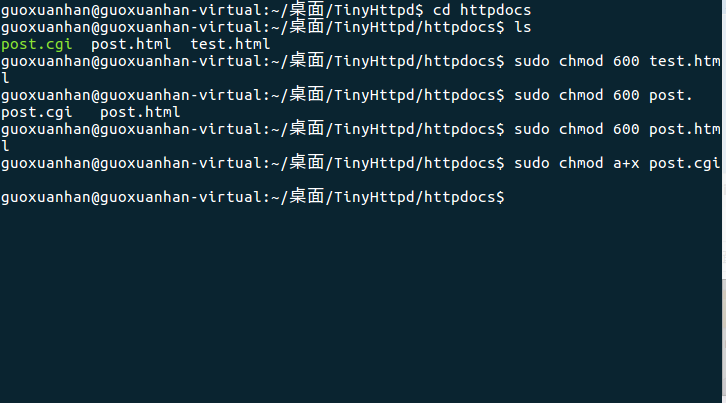
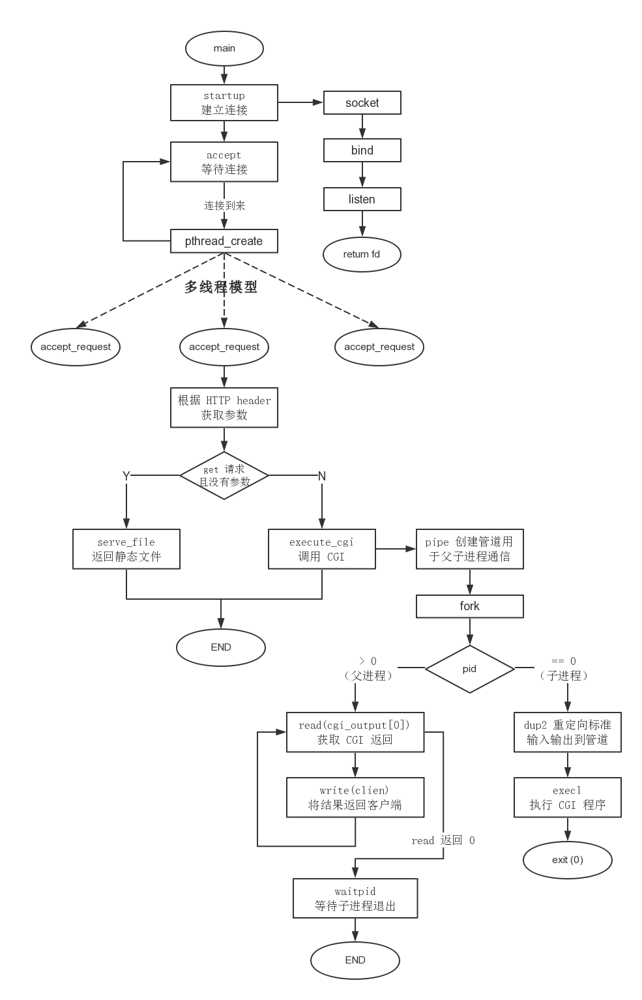

## TinyHttpd项目简介
在linux下基于《Linux高性能服务器编程》和tinyhttpd扩展实现的C++轻量级HttpServer，基于epoll事件驱动I/O，采用高效的Reactor模型+线程池进行客户端连接任务管理，支持高并发的静态与动态http请求。项目有详细中文注释，适合新手入门！ 

## 项目构建准备工作

post.html、post.cgi和test.html需要一定的权限才可以执行
1. cd httpdocs
2. sudo chmod 600 post.html
3. sudo chmod 600 test.html
4. sudo chmod a+x post.cgi

## 项目构建方法Linux

1. git clone https://github.com/guoxuanhan/TinyHttpd.git
2. 解压缩 unzip TinyHttpd-master.zip
   没有zip工具可以先安装
   sudo yum -y install unzip
4. cd TinyHttpd-master
5. make
6. ./myhttp

## 运用到的技术

1. 动态请求解析技术CGI
2. Reactor模式
3. epoll I/O多路复用
4. 线程池
5. socket网络编程相关知识
6. http报文格式
7. http请求命令 get/post
8. 进程通信（管道pipe）

## 改进方向

1. 增加命令行解析
2. 增加定时器删除不常用连接
3. 内存池

## 框架流程图

## 参考文章

1. [网络编程模式Reactor详解](https://blog.csdn.net/qq_39751437/article/details/105446909)
2. [计算机网络与网络编程主要面试内容](https://blog.csdn.net/qq_39751437/article/details/104969909)
3. [C++实现的高并发web服务器](https://github.com/Fizell/webServer)
4. [高性能HTTP服务器:设计和思路](https://blog.csdn.net/qq_41111491/article/details/104288554)
5. [TinyHttpd精读](https://www.cnblogs.com/nengm1988/p/7816618.html)
6. [20分钟彻底了解epoll](https://www.debugger.wiki/article/html/1554202800691456)
7. [linux下搭建wenserver](https://github.com/qinguoyi/TinyWebServer)
